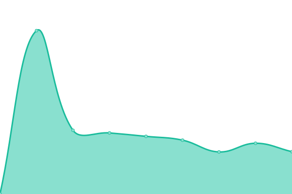

# [📈 Live Status](https://sysmike.github.io/upptime): <!--live status--> **🟧 Partial outage**

This repository contains the open-source uptime monitor and status page for [Michael](https://sysmike.github.io/upptime), powered by [Upptime](https://github.com/upptime/upptime).

With [Upptime](https://upptime.js.org), you can get your own unlimited and free uptime monitor and status page, powered entirely by a GitHub repository. We use [Issues](https://github.com/sysmike/upptime/issues) as incident reports, [Actions](https://github.com/sysmike/upptime/actions) as uptime monitors, and [Pages](https://sysmike.github.io/upptime) for the status page.

<!--start: status pages-->
<!-- This summary is generated by Upptime (https://github.com/upptime/upptime) -->
<!-- Do not edit this manually, your changes will be overwritten -->
<!-- prettier-ignore -->
| URL | Status | History | Response Time | Uptime |
| --- | ------ | ------- | ------------- | ------ |
|  Backup MX | 🟩 Up | [backup-mx.yml](https://github.com/sysmike/upptime/commits/HEAD/history/backup-mx.yml) | 

 772ms
     
 | 

<a href="https://sysmike.github.io/upptime/history/backup-mx">100.00%</a>
    

|  Files | 🟩 Up | [files.yml](https://github.com/sysmike/upptime/commits/HEAD/history/files.yml) | 

 565ms
     
 | 

<a href="https://sysmike.github.io/upptime/history/files">100.00%</a>
    

|  gotosocial | 🟥 Down | [gotosocial.yml](https://github.com/sysmike/upptime/commits/HEAD/history/gotosocial.yml) | 

 676ms
     
 | 

<a href="https://sysmike.github.io/upptime/history/gotosocial">84.19%</a>
    

|  Landing page | 🟩 Up | [landing-page.yml](https://github.com/sysmike/upptime/commits/HEAD/history/landing-page.yml) | 

 571ms
     
 | 

<a href="https://sysmike.github.io/upptime/history/landing-page">100.00%</a>
    

|  Matomo | 🟩 Up | [matomo.yml](https://github.com/sysmike/upptime/commits/HEAD/history/matomo.yml) | 

 1148ms
     
 | 

<a href="https://sysmike.github.io/upptime/history/matomo">100.00%</a>
    

|  Mail | 🟩 Up | [mail.yml](https://github.com/sysmike/upptime/commits/HEAD/history/mail.yml) | 

 826ms
     
 | 

<a href="https://sysmike.github.io/upptime/history/mail">100.00%</a>
    

|  PrivateBin | 🟩 Up | [private-bin.yml](https://github.com/sysmike/upptime/commits/HEAD/history/private-bin.yml) | 

 640ms
     
 | 

<a href="https://sysmike.github.io/upptime/history/private-bin">100.00%</a>
    

|  Share | 🟩 Up | [share.yml](https://github.com/sysmike/upptime/commits/HEAD/history/share.yml) | 

 819ms
     
 | 

<a href="https://sysmike.github.io/upptime/history/share">100.00%</a>
    

|  Sysmikes Blog | 🟩 Up | [sysmikes-blog.yml](https://github.com/sysmike/upptime/commits/HEAD/history/sysmikes-blog.yml) | 

 932ms
     
 | 

<a href="https://sysmike.github.io/upptime/history/sysmikes-blog">100.00%</a>
    

|  Teamspeak | 🟩 Up | [teamspeak.yml](https://github.com/sysmike/upptime/commits/HEAD/history/teamspeak.yml) | 

 109ms
     
 | 

<a href="https://sysmike.github.io/upptime/history/teamspeak">100.00%</a>
    

|  vCard | 🟩 Up | [v-card.yml](https://github.com/sysmike/upptime/commits/HEAD/history/v-card.yml) | 

 710ms
     
 | 

<a href="https://sysmike.github.io/upptime/history/v-card">100.00%</a>
    

|  Webserver | 🟩 Up | [webserver.yml](https://github.com/sysmike/upptime/commits/HEAD/history/webserver.yml) | 

 109ms
     
 | 

<a href="https://sysmike.github.io/upptime/history/webserver">100.00%</a>
    

<!--end: status pages-->

[**Visit our status website →**](https://sysmike.github.io/upptime)

## 📄 License

- Powered by: [Upptime](https://github.com/upptime/upptime)
- Code: [MIT](./LICENSE) © [Michael](https://sysmike.github.io/upptime)
- Data in the `./history` directory: [Open Database License](https://opendatacommons.org/licenses/odbl/1-0/)
